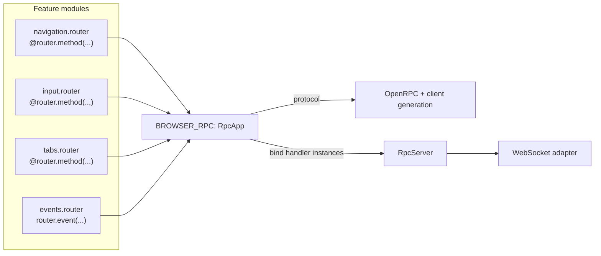
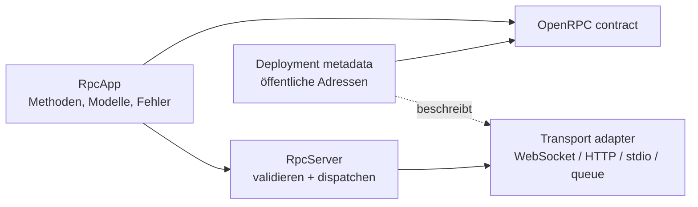

Gmail Mathis Arends <mathisarends27@gmail.com>
RPCKIT SPEC
Mathis Arends <mathisarends27@gmail.com> 8. September 2026 um 08:02
An: Mathis Arends <mathisarends27@gmail.com>

# RPC Kit: eine cleanere, FastAPI-artige API

## Kurzfassung

`rpckit` ist intern bereits sauber geschnitten: Handler, Protokoll, Dispatcher,
Server, OpenRPC und Codegenerierung sind getrennt. Die aktuelle Developer
Experience zwingt einen Consumer aber dazu, dieselbe API-Struktur mehrfach zu
benennen:

1. `@rpckit.method(...)` markiert Methoden.

2. `BROWSER_RPC_METHODS` listet die Handler-Klassen für das Schema.

3. `browser_rpc_methods(...)` baut dieselben Handler als Instanzen für den Server.

4. `BROWSER_PROTOCOL` gruppiert die Klassen nochmals in einem Feature.

Die empfohlene Änderung ist deshalb **kein funktionaler Rewrite**, sondern eine
dünne deklarative Schicht aus `RpcRouter` und `RpcApp`:

- Methoden werden wie FastAPI-Routen an einem lokalen `router` deklariert.

- `prefix` und `tags` ersetzen wiederholte vollständige Methodennamen und
  `feature(...)`.

- Eine zentrale `RpcApp` inkludiert die Router und ist die einzige Quelle für
  Protokoll und OpenRPC.

- `app.bind(...)` verbindet die deklarierte API mit zustandsbehafteten
  Handler-Instanzen und liefert den bestehenden `RpcServer`.

- Die Handler dürfen Klassen bleiben und behalten ihre explizite Constructor
  Injection.
Damit wird die API FastAPI-artig, ohne `rpckit` an HTTP, ASGI, FastAPI selbst oder
einen Dependency-Injection-Container zu koppeln.

## Was heute bereits gut ist

Die Library hat mehrere Eigenschaften, die wir nicht verlieren sollten:

- Der Wire Contract ist JSON-RPC 2.0 und wird als OpenRPC exportiert.

- Parameter und Ergebnisse sind explizite Pydantic-Modelle.

- Fehler sind Teil der Methodendeklaration und werden serverseitig abgeschirmt.

- Schemaerzeugung geschieht ohne laufenden Server.

- Der Server bleibt transportagnostisch; WebSocket, HTTP, stdio oder Queue sind
  Adapter außerhalb des Kerns.

- Zustandsbehaftete Abhängigkeiten werden heute klar im Konstruktor eines
  Handlers übergeben.

- Ungültige oder unvollständige Protokolle scheitern beim Zusammenbau und nicht
  erst während eines Requests.
Das Ziel ist also, die **Komposition** zu vereinfachen, nicht diese Eigenschaften
zu ersetzen.

## Heutiger Zustand im Repository

Eine Browser-Navigationsmethode wird derzeit lokal so deklariert:

```python
class NavigationMethods(rpckit.RpcHandler):
    def __init__(self, navigation: BrowserNavigation) -> None:
        self._navigation = navigation

    @rpckit.method(NavigationMethod.NAVIGATE)
    async def navigate(self, params: NavigateParams) -> None:
        await self._navigation.navigate(params.url)
```

Danach folgt die doppelte Komposition:

```python
BROWSER_RPC_METHODS = (
    LifecycleMethods,
    NavigationMethods,
    InputMethods,
    ClipboardMethods,
    TabMethods,
)


def browser_rpc_methods(browser: Browser) -> tuple[rpckit.RpcHandler, ...]:
    return (
        LifecycleMethods(),
        NavigationMethods(browser.navigation),
        InputMethods(browser.input),
        ClipboardMethods(browser.clipboard),
        TabMethods(browser.tabs),
    )
```

und schließlich:

```python
BROWSER_PROTOCOL = rpckit.RpcProtocol(
    rpckit.feature(
        "browser",
        handlers=BROWSER_RPC_METHODS,
        notifications=(...),
    ),
    version=2,
)
server = rpckit.RpcServer(
    *browser_rpc_methods(browser),
    protocol=BROWSER_PROTOCOL,
)
```

Die Methodendeklaration selbst ist gut. Die Unruhe entsteht danach: Klassen und
Instanzen müssen synchron gehalten werden, und die Feature-Zuordnung liegt weit
entfernt von der Methode, die sie beschreibt.

## Zielbild



`RpcApp` ist damit die eine API-Definition. OpenRPC und Runtime leiten sich von
demselben Objekt ab; nur die konkreten, zustandsbehafteten Handler werden pro
Browser-Session gebunden.

## So sollte sich die API anfühlen

### Lokaler Router anstelle globaler Methodennamen

```python
import rpckit
from backend.features.browser_tunnel.application import BrowserNavigation
from backend.features.browser_tunnel.presentation.rpc.models import (
    NavigateParams,
    ReloadParams,
)

router = rpckit.RpcRouter(prefix="browser.nav", tags=("browser",))


class NavigationMethods:
    def __init__(self, navigation: BrowserNavigation) -> None:
        self._navigation = navigation

    @router.method("navigate")
    async def navigate(self, params: NavigateParams) -> None:
        await self._navigation.navigate(params.url)

    @router.method("back")
    async def back(self) -> None:
        await self._navigation.back()

    @router.method("forward")
    async def forward(self) -> None:
        await self._navigation.forward()

    @router.method("reload")
    async def reload(self, params: ReloadParams) -> None:
        await self._navigation.reload(ignore_cache=params.ignore_cache)

    @router.method("stop")
    async def stop(self) -> None:
        await self._navigation.stop()
```

Wesentliche Unterschiede zur heutigen Variante:

- `router.method` entspricht mental `APIRouter.get/post/...`.

- Der Namespace wird einmal als `prefix` gesetzt.

- Der OpenRPC-Tag liegt am Router und damit beim Feature-Modul.

- `RpcHandler` als leere Marker-Basisklasse ist nicht mehr nötig.

- Die Klasse und ihre Constructor Injection bleiben unverändert.

- Die bestehenden Pydantic-Modelle, Fehler und Methodensignaturen bleiben die
  Quelle für den Contract.
Fehler bleiben direkt an der Operation sichtbar:

```python
router = rpckit.RpcRouter(prefix="browser.tab", tags=("browser",))


class TabMethods:
    def __init__(self, tabs: BrowserTabs) -> None:
        self._tabs = tabs

    @router.method("activate", errors=(BrowserTabNotFound,))
    async def activate(self, params: TabParams) -> TabsResult: ...
```

### Events am Router

Ein serverseitiges Event besitzt keinen ausführbaren Handler. Deshalb sollte es
nicht künstlich als Decorator modelliert, sondern explizit am Router registriert
werden:

```python
router = rpckit.RpcRouter(prefix="browser", tags=("browser",))
router.event(
    "event",
    BrowserEvent,
    summary="Stream browser state to the frontend.",
)
```

Der resultierende Wire-Name ist `browser.event`. Auf der öffentlichen
`rpckit`-Ebene heißt dieses Konzept bewusst **Event**. Auf dem JSON-RPC-Wire wird
es als Notification, also als Nachricht ohne `id`, codiert. Der Begriff
`notification` bleibt damit ein Implementierungs- und Wire-Begriff und erscheint
nicht in der normalen Consumer-API.

### Zentrale Komposition

```python
import rpckit
from backend.features.browser_tunnel.presentation.rpc import events
from backend.features.browser_tunnel.presentation.rpc.methods import (
    clipboard,
    input,
    lifecycle,
    navigation,
    tabs,
)

BROWSER_RPC = rpckit.RpcApp(version=2)
BROWSER_RPC.include_router(lifecycle.router)
BROWSER_RPC.include_router(navigation.router)
BROWSER_RPC.include_router(input.router)
BROWSER_RPC.include_router(clipboard.router)
BROWSER_RPC.include_router(tabs.router)
BROWSER_RPC.include_router(events.router)
```

Optional kann `include_router` wie bei FastAPI einen zusätzlichen Prefix und
zusätzliche Tags ergänzen:

```python
BROWSER_RPC.include_router(admin.router, prefix="internal", tags=("admin",))
```

Dabei gelten durchgehend dieselben Kompositionsregeln:

- Der Include-Prefix wird dem Router-Prefix mit einem Punkt vorangestellt.
  `prefix="internal"` und Router-Prefix `browser.admin` ergeben somit
  `internal.browser.admin`.

- Include-Tags werden nach den vorhandenen Router-Tags angehängt und unter
  Beibehaltung des ersten Auftretens dedupliziert. Router-Tags
  `("browser", "control")` und Include-Tags `("internal", "browser")` ergeben
  somit `("browser", "control", "internal")`. Es gibt kein implizites
  Überschreiben.

- Zwei Routen mit demselben vollständigen Wire-Namen ergeben sofort einen
  `ProtocolDefinitionError`, auch wenn sie aus verschiedenen Routern stammen.

- `include_router` materialisiert einen Snapshot. Spätere Änderungen am
  Child-Router verändern die bereits inkludierten Routen nicht.

Ein Router darf mehrfach unter unterschiedlichen Prefixen inkludiert werden:

```python
primary = app.include_router(navigation.router, prefix="primary")
secondary = app.include_router(navigation.router, prefix="secondary")
```

Da beide Mounts dieselben deklarierten Funktionen referenzieren, bedient eine
normal an `app.bind(...)` übergebene Handler-Instanz standardmäßig beide
Namensräume. Sollen die Mounts unterschiedliche Instanzen verwenden, muss die
Zuordnung explizit sein:

```python
server = app.bind(
    primary.bind(NavigationMethods(primary_navigation)),
    secondary.bind(NavigationMethods(secondary_navigation)),
)
```

`include_router` gibt dafür ein unveränderliches `RpcRouterMount` zurück. Dessen
`bind(...)` erzeugt lediglich eine explizite Handler-zu-Mount-Zuordnung; ohne
diese Zuordnung bleibt Binding über Funktionsidentität die einfache
Standardsemantik.

### Binden der zustandsbehafteten Klassen

```python
server = BROWSER_RPC.bind(
    LifecycleMethods(),
    NavigationMethods(browser.navigation),
    InputMethods(browser.input),
    ClipboardMethods(browser.clipboard),
    TabMethods(browser.tabs),
)
```

Das ist die einzige notwendige Runtime-Komposition. Es gibt kein paralleles
Tupel von Handler-Klassen mehr. `bind` prüft beim Erzeugen des Servers:

- Jede deklarierte Methode ist genau einmal gebunden.

- Keine unbekannte dekorierte Methode wird zusätzlich gebunden.

- Zwei Instanzen dürfen nicht dieselbe RPC-Methode bedienen.

Falls die Session schlanker bleiben soll, kann das Feature eine kleine Factory
anbieten:

```python
def browser_rpc_server(browser: Browser) -> rpckit.RpcServer:
    return BROWSER_RPC.bind(
        LifecycleMethods(),
        NavigationMethods(browser.navigation),
        InputMethods(browser.input),
        ClipboardMethods(browser.clipboard),
        TabMethods(browser.tabs),
    )
```

Dann enthält `BrowserSession` nur noch:

```python
self._server = browser_rpc_server(browser)
```

### Freie Funktionen ohne künstliche Handler-Klasse

Freie Funktionen sind ein vollständiger Runtime-Anwendungsfall. Sie sind nach
der Deklaration bereits aufrufbar und benötigen beim Binden keine Instanz:

```python
router = rpckit.RpcRouter()


@router.method("ping")
async def ping() -> None:
    pass


app = rpckit.RpcApp()
app.include_router(router)
server = app.bind()
```

Der Wire-Name bleibt auch hier explizit; er wird nicht aus `ping.__name__`
abgeleitet. `app.bind()` bindet freie Funktionen direkt und verlangt nur für
deklarierte Instanzmethoden konkrete Handler-Instanzen. Dadurch bleiben kleine,
zustandslose APIs knapp, während zustandsbehaftete Features weiterhin normale
Klassen mit Constructor Injection verwenden.

### Schema und Codegenerierung auf Protokollebene

`RpcApp` stellt sein validiertes `protocol` bereit:

```python
document = render_openrpc(
    BROWSER_RPC.protocol,
    title="Browser Tunnel",
)
```

Als Low-Level-Komfort kann die CLI zusätzlich `RpcApp` direkt akzeptieren:

```bash
rpckit schema \
  backend.features.browser_tunnel.presentation.rpc:BROWSER_RPC \
  --output scripts/codegen/openrpc/backend-browser-tunnel.openrpc.json \
  --title "Browser Tunnel"
```

So bleibt die API wie heute ohne Browser, WebSocket oder laufenden Server
importierbar. Sobald öffentliche URLs oder Transport-Metadaten mit exportiert
werden sollen, ist der weiter unten vorgeschlagene `OpenRpcContract` jedoch der
bessere CLI-Einstiegspunkt.

## Transport, WebSocket-Endpunkt und OpenRPC-Server

### Drei Dinge, die getrennt bleiben sollten

Für diesen Teil hilft eine klare begriffliche Trennung:



1. **`RpcApp`** beschreibt, _was_ aufgerufen werden kann. Sie kennt weder
   WebSocket noch eine URL.

2. **`RpcServer`** führt Requests aus. Er arbeitet weiterhin mit bereits
   dekodierten Python-Objekten und erzeugt Response-Envelopes.

3. **Transport und Deployment** beschreiben, _wie und wo_ die Envelopes
   übertragen werden.
Die Route gehört damit nicht in `RpcRouter(prefix="browser.nav")`: Dieser Prefix
ist ein JSON-RPC-Methodennamespace und kein URL-Pfad. Die öffentliche Route darf
aber sehr wohl im erzeugten OpenRPC-Dokument stehen.

### Was OpenRPC standardkonform ausdrücken kann

OpenRPC 1.4.x besitzt auf Dokument- und Methodenebene ein `servers`-Array. Ein
Server hat eine `url`; diese darf relativ sein und Variablen in `{...}` enthalten.
Damit lässt sich die konkrete WebSocket-Route bereits ohne Extension ausdrücken:

```json
{
  "servers": [
    {
      "name": "browser-control",
      "url": "wss://{host}/api/v1/projects/{projectId}/browser-tunnel/sessions/{sessionId}/control",
      "summary": "Browser control over JSON-RPC 2.0 via WebSocket",
      "variables": {
        "host": {
          "default": "api.example.com"
        },
        "projectId": {
          "default": "00000000-0000-0000-0000-000000000000",
          "description": "Project selected by the authenticated caller."
        },
        "sessionId": {
          "default": "00000000-0000-0000-0000-000000000000",
          "description": "Session returned by openBrowserTunnelSession."
        }
      }
    }
  ]
}
```

Das `wss`-Scheme und der vollständige Pfad transportieren bereits die wichtigste
Information: Dies ist eine WebSocket-Verbindung zu genau diesem Endpunkt. Das
verstößt nicht gegen OpenRPC. Auch mehrere Alternativen sind möglich, etwa ein
lokaler `ws://...`- und ein produktiver `wss://...`-Server oder parallel ein
HTTP-Endpunkt für dieselbe `RpcApp`.
Im Repository ist die Unterstützung dafür teilweise schon vorhanden:

- `render_openrpc(..., servers=...)` schreibt `servers` in das Dokument.

- Die CLI unterstützt `--server NAME=URL`.

- Das Browser-Tunnel-Codegen-Script übergibt aktuell keinen Server; deshalb steht
  im committed Contract lediglich `"servers": []`.
Als kleinster sofortiger Schritt könnte das Script bereits eine konkrete oder
templatisierte URL übergeben. Für vollständige `variables` reicht der heutige
`NAME=URL`-Parser allerdings nicht aus.

### Was OpenRPC nicht standardisiert

OpenRPC beschreibt JSON-RPC, aber keine vollständigen transportspezifischen
Bindings. Insbesondere gibt es dort keine standardisierten Felder für:

- WebSocket-Handshake-Header und Query-Parameter,

- Authentifizierung beim Upgrade,

- Subprotocol Negotiation,

- Text- versus Binary-Frames,

- Reconnect- und Keepalive-Verhalten.

Für solche Details gibt es zwei saubere Optionen:

1. Sie bleiben in normaler Dokumentation beziehungsweise `description`.

2. Sie werden als OpenRPC Specification Extension mit einem `x-`-Präfix ergänzt.

OpenRPC erlaubt solche Extensions ausdrücklich. Für `rpckit` könnte eine bewusst
kleine, versionierte Erweiterung so aussehen:

```json
{
  "x-rpckit-transport": {
    "type": "websocket",
    "bindingVersion": "1.0",
    "frameType": "text",
    "messageEncoding": "json"
  }
}
```

Diese Extension sollte **nur Zusatzinformation** sein. Ein generischer
OpenRPC-Consumer muss die API allein mit `servers[].url` und den normalen
Methodendefinitionen verstehen können. Interne Generatoren dürfen die Extension
nutzen, fremde Tools dürfen sie ignorieren.
AsyncAPI besitzt zwar explizite WebSocket-Bindings für Handshake-Methode, Query
und Header. Ein zweites AsyncAPI-Dokument allein für die Route wäre hier aber
wahrscheinlich doppelte Contract-Pflege. Es lohnt sich erst, wenn die
bidirektionalen Streams und mehrere Transportspezifika selbst ein primärer,
tragender Contract werden sollen. OpenRPC plus eine kleine Extension ist für den
aktuellen JSON-RPC-zentrierten Fall kohärenter.
Quellen:

- [OpenRPC: Server Object, Server Variables und Specification Extensions](https://spec.open-rpc.org/)

- [AsyncAPI: WebSocket Binding](https://www.asyncapi.com/docs/reference/bindings/websockets)

- [AsyncAPI 3.0: transportspezifische Bindings](https://www.asyncapi.com/docs/reference/specification/v3.0.0)

### Empfohlene API für Deployment-Metadaten

Serveradressen sollten nicht fest in `RpcApp` eingebrannt werden. Dieselbe API
kann in Tests über einen In-memory-Transport, lokal über `ws`, produktiv über
`wss` und später eventuell über HTTP laufen. Deshalb sollte die OpenRPC-Schicht
einen eigenen, typisierten Deployment-Descriptor bekommen:

```python
BROWSER_RPC_CONTRACT = rpckit.OpenRpcContract(
    app=BROWSER_RPC,
    title="Backend Browser Tunnel",
    servers=(
        rpckit.OpenRpcServer(
            name="browser-control",
            url=(
                "wss://{host}/api/v1/projects/{projectId}/browser-tunnel/"
                "sessions/{sessionId}/control"
            ),
            variables={
                "host": rpckit.ServerVariable(default="api.example.com"),
                "projectId": rpckit.ServerVariable(
                    default="00000000-0000-0000-0000-000000000000"
                ),
                "sessionId": rpckit.ServerVariable(
                    default="00000000-0000-0000-0000-000000000000"
                ),
            },
            extensions={
                "x-rpckit-transport": {
                    "type": "websocket",
                    "bindingVersion": "1.0",
                    "frameType": "text",
                    "messageEncoding": "json",
                }
            },
        ),
    ),
)
```

Die CLI zeigt dann direkt auf den vollständigen Contract statt auf ein nacktes
Protokoll:

```bash
rpckit schema \
  backend.features.browser_tunnel.presentation.rpc:BROWSER_RPC_CONTRACT \
  --output scripts/codegen/openrpc/backend-browser-tunnel.openrpc.json
```

Vorteile dieser Trennung:

- `BROWSER_RPC` bleibt vollständig transportagnostisch und wiederverwendbar.

- Der committed OpenRPC-Contract enthält trotzdem die reale Route.

- Umgebungen und alternative Transporte können eigene Contracts auf derselben
  App aufbauen.

- Titel, Beschreibung, Servervariablen und Extensions sind typisiert und müssen
  nicht in Shell-Argumenten gequetscht werden.

- Der Codegenerator bekommt weiterhin ein normales, valides OpenRPC-Dokument.

`OpenRpcContract` ist dabei reine Beschreibung und startet keinen Server. Das
verhindert, dass Schemaexport versehentlich Runtime-Ressourcen oder das Backend
initialisieren muss.

### Optionaler FastAPI-WebSocket-Decorator

Die FastAPI-Integration soll den vorhandenen `fastapi.APIRouter` weder ersetzen,
subclassen noch zur Laufzeit patchen. Die Route bleibt eine normale
FastAPI-WebSocket-Route. Ein zusätzlicher Decorator wandelt ihre Funktion in eine
verbindungsspezifische RPC-Binding-Factory um:

```python
from dishka.integrations.fastapi import FromDishka, inject
from fastapi import Query, WebSocket
from rpckit.fastapi import rpc_websocket


@browser_tunnel_router.websocket(
    "/sessions/{session_id}/control",
)
@rpc_websocket(BROWSER_CONTROL_API)
@inject
async def browser_control(
    websocket: WebSocket,
    session_id: UUID,
    token: Annotated[str, Query()],
    session: FromDishka[ProjectBrowserTunnelSession],
) -> rpckit.RpcBinding:
    browser = await session.browser(session_id, token=token)

    return rpckit.RpcBinding(
        handlers=(
            NavigationMethods(browser.navigation),
            InputMethods(browser.input),
            TabMethods(browser.tabs),
        ),
        events=browser.events,
    )
```

Die Decorator-Reihenfolge ist Teil der öffentlichen API:

```python
@router.websocket(path)
@rpc_websocket(RPC_API)
@inject
async def connection_factory(...) -> rpckit.RpcBinding:
    ...
```

FastAPI registriert und analysiert weiterhin den äußeren WebSocket-Endpoint.
`rpc_websocket` muss die Signatur der dekorierten Funktion vollständig erhalten,
damit FastAPI Path-, Query-, Header-, Cookie- und `Depends`-Parameter unverändert
auflöst. Dishka bleibt für `FromDishka` und den WebSocket-`SESSION`-Scope
zuständig. `rpckit` implementiert keine eigene Dependency Injection.

Die dekorierte Funktion wird genau einmal pro WebSocket-Verbindung aufgerufen.
Ihr `RpcBinding`-Rückgabewert ist keine zu serialisierende WebSocket-Nachricht.
Der `rpc_websocket`-Decorator konsumiert ihn intern, bindet die Handler an die API
und startet danach den Receive-/Send-Loop. Der Rückgabewert ist notwendig, weil
die Handler erst nach FastAPIs Parameterauflösung und Dishkas Injection aus dem
verbindungsspezifischen Browser beziehungsweise der Session erzeugt werden
können.

`RpcBinding` ist eine reine Binding-Beschreibung und keine bereits laufende
Verbindung:

```python
@dataclass(frozen=True, slots=True)
class RpcBinding:
    handlers: tuple[object, ...]
    events: AsyncIterable[object] | None = None
```

Der erste Schnitt verwendet ausschließlich `return RpcBinding(...)`. Eine
Async-Generator- beziehungsweise `yield`-Variante ist vorerst bewusst nicht Teil
der API. Ressourcen-Cleanup erfolgt über den bestehenden Dishka-`SESSION`-Scope
und die Disconnect-/Cancellation-Behandlung des Adapters.

Der Adapter übernimmt:

- `accept`, Receive/Send und JSON-Encoding,

- Parse-Errors und Response-Envelopes,

- das Auslassen einer Response bei eingehenden JSON-RPC-Notifications,

- das Weiterleiten serverinitiierter Events aus dem `RpcBinding` als
  JSON-RPC-Notifications,

- sauberes Schließen und Cancellation.

Die Backend-spezifische Orchestrierung – Authentifizierung, Erzeugen des Browsers,
Favicon-Scheduling und Session-Lebenszyklus – bleibt in der Connection Factory.
Ein Dishka-`REQUEST`-Scope pro eingehender RPC-Nachricht ist nicht Bestandteil des
ersten Schnitts; die injizierten Abhängigkeiten leben im WebSocket-`SESSION`-Scope.

Der lokale Pfad der FastAPI-Route und die vollständige öffentliche URL bleiben
getrennt. Die vollständige Deployment-Adresse, beispielsweise
`/api/v1/projects/{project_id}/browser-tunnel/sessions/{session_id}/control`,
steht weiterhin explizit im `OpenRpcContract`. Eine automatische Introspection
des fertig assemblierten FastAPI-Routers ist für den ersten Schnitt nicht
vorgesehen.

## Ist das mit klassenbasierten Handlern überhaupt möglich?

Ja. Python führt den Methodendecorator während der Definition des Klassenkörpers
aus. `router.method(...)` kann deshalb dieselben Informationen erfassen wie der
heutige globale Decorator:

- die ungebundene Funktion,

- RPC-Name,

- Parameter- und Ergebnistyp,

- Summary und deklarierte Fehler,

- den Router, an dem die Funktion registriert wurde.

Beim späteren `bind(instance)` läuft `rpckit` über die konkrete Klasse und bindet
die registrierte ungebundene Funktion über das Descriptor-Protokoll an die
Instanz. Konzeptionell:

```python
bound = route.function.__get__(handler_instance)
```

Genau dieses Binden macht der aktuelle `RpcDispatcher` bereits. Neu ist nur,
dass die Contract-Definition vom Router stammt, statt ein zweites Mal über ein
Tupel von Handler-Klassen eingesammelt zu werden.
Ein zusätzlicher Klassendecorator wie `@router.handler` ist technisch möglich,
aber nicht nötig. Er würde die FastAPI-artige Oberfläche wieder um eine zweite
Registrierung erweitern. Die Methodendecorators enthalten bereits genug
Informationen.

## Vorgeschlagene öffentliche API

```python
class RpcRouter:
    def __init__(
        self,
        *,
        prefix: str = "",
        tags: Iterable[str] = (),
    ) -> None: ...
    def method(
        self,
        name: str,
        *,
        summary: str | None = None,
        errors: Iterable[type[RpcError]] = (),
    ) -> Callable[[HandlerT], HandlerT]: ...
    def event(
        self,
        name: str,
        payload: Any,
        *,
        summary: str | None = None,
    ) -> None: ...
    def include_router(
        self,
        router: RpcRouter,
        *,
        prefix: str = "",
        tags: Iterable[str] = (),
    ) -> None: ...


class RpcApp:
    def __init__(self, *, version: int = 1) -> None: ...
    @property
    def protocol(self) -> RpcProtocol: ...
    def include_router(
        self,
        router: RpcRouter,
        *,
        prefix: str = "",
        tags: Iterable[str] = (),
    ) -> RpcRouterMount: ...
    def bind(
        self,
        *handlers: object | RpcMountBinding,
        error_mapper: RpcErrorMapper | None = None,
    ) -> RpcServer: ...


class RpcRouterMount:
    def bind(self, *handlers: object) -> RpcMountBinding: ...


class RpcMountBinding: ...


@dataclass(frozen=True, slots=True)
class ServerVariable:
    default: str
    description: str | None = None
    enum: tuple[str, ...] = ()


@dataclass(frozen=True, slots=True)
class OpenRpcServer:
    name: str
    url: str
    summary: str | None = None
    description: str | None = None
    variables: Mapping[str, ServerVariable] = field(default_factory=dict)
    extensions: Mapping[str, Any] = field(default_factory=dict)


@dataclass(frozen=True, slots=True)
class OpenRpcContract:
    app: RpcApp
    title: str
    description: str = "Typed JSON-RPC API."
    servers: tuple[OpenRpcServer, ...] = ()
```

`prefix` wird für JSON-RPC mit Punkten normalisiert:

```text
prefix="browser.nav" + name="navigate" -> "browser.nav.navigate"
prefix=""            + name="health"   -> "health"
```

Leere Segmente, führende oder folgende Punkte und doppelte Punkte sollten beim
Zusammenbau als `ProtocolDefinitionError` abgelehnt werden. Implizites Ableiten
des Wire-Namens aus dem Python-Funktionsnamen sollte vermieden werden: Ein
expliziter Name hält Refactorings sicher und macht den Wire Contract sichtbar.

## Interne Umsetzung

### 1. Route statt Metadaten allein

Der Router sollte intern unveränderliche Deklarationen sammeln:

```python
@dataclass(frozen=True, slots=True)
class RpcRoute:
    name: str
    function: FunctionType
    summary: str | None
    errors: tuple[type[RpcError], ...]
    tags: tuple[str, ...]
```

Die bestehende `RpcMethodDefinition` kann daraus fast unverändert erzeugt
werden. Für die Bindung sollte die Funktionsidentität erhalten bleiben; nur mit
`handler_name` zu matchen wäre bei gleichnamigen Methoden verschiedener Klassen
zu schwach.

### 2. Router-Komposition

`include_router` sollte Routen in die aufnehmende Komposition kopieren bzw.
normalisiert materialisieren. Dabei werden Prefixe und Tags kombiniert und
doppelte vollständige RPC-Namen sofort abgelehnt. Das entspricht dem nützlichen
Teil des `APIRouter`-Modells, ohne HTTP-spezifische Optionen zu übernehmen.
Wichtig: Nach dem Include sollte klar definiert sein, ob spätere Änderungen am
Child-Router sichtbar werden. Für `rpckit` ist **Snapshot beim Include** die
einfachere und deterministischere Semantik. Dann sollte nach dem ersten Zugriff
auf `app.protocol` keine weitere Mutation der App erlaubt sein. Alternativ kann
eine Live-Komposition implementiert werden; sie ist flexibler, benötigt aber
saubere Cache-Invalidierung. Für Version 1 dieser API ist Snapshot/Frozen zu
bevorzugen.

### 3. App als einzige Protocol Factory

`RpcApp.protocol` baut und cached einen `RpcProtocol`. `render_openrpc`, die CLI
und `bind` greifen auf genau dieses Protokoll zu. Es darf keine zweite Logik für
Schema und Runtime geben.

### 4. Bindung über Funktionsidentität

Der Binder inspiziert die Typen der übergebenen Instanzen, findet die mit dieser
App registrierten Funktionen und bindet sie an die Instanzen. Dabei bleibt die
heutige Vollständigkeitsprüfung in `RpcDispatcher` erhalten. Nicht dekorierte
Hilfsmethoden werden ignoriert. Freie Funktionen werden direkt als ausführbare
Callables übernommen und gelten auch bei `app.bind()` ohne Argumente als
vollständig gebunden.

Die Routendeklaration muss deshalb zuverlässig zwischen einer freien Funktion und
einer Instanzmethode unterscheiden können. Diese Information darf nicht allein
aus dem Funktionsnamen oder einem Parameter namens `self` abgeleitet werden. Die
Implementierung kann beispielsweise einen Decorator-Descriptor mit
`__set_name__` verwenden, um die besitzende Klasse nach Abschluss des
Klassenkörpers in der privaten Binding-Referenz zu erfassen.

### 5. Konkrete Binding-Diagnosen

Binding-Fehler müssen den vollständigen Wire-Namen, die deklarierende
Python-Funktion und eine konkrete Abhilfe nennen. Eine reine maschinenartige
Liste wie `missing=["browser.nav.navigate"]` reicht nicht aus. Bei einem
fehlenden Handler lautet die Diagnose beispielsweise:

```text
No handler instance for browser.nav.navigate.
Declared by NavigationMethods.navigate.
Pass a NavigationMethods instance to app.bind(...).
```

Bei doppelten Handlern müssen sowohl die Deklaration als auch alle kollidierenden
Binding-Herkünfte stabil und ohne speicheradressabhängiges `repr` erscheinen:

```text
Multiple handler instances for browser.nav.navigate.
Declared by NavigationMethods.navigate.
Matched handlers:
- app.bind() argument 1: NavigationMethods
- app.bind() argument 3: NavigationMethods
Pass exactly one matching instance or use an explicit router-mount binding.
```

Bei einer unbekannten dekorierten Methode nennt die Diagnose entsprechend die
Handler-Klasse, die Python-Methode und deren RPC-Wire-Namen. Das ist insbesondere
nach dem Wegfall der Marker-Basisklasse erforderlich, damit Konfigurationsfehler
ohne Kenntnis der internen Binding-Logik behoben werden können.

### 6. Rückwärtskompatibilität

Die bestehende API kann zunächst vollständig erhalten bleiben:

- `@rpckit.method(...)`

- `RpcHandler`

- `feature(...)`

- `RpcProtocol(...)`

- `RpcServer(*handlers, protocol=...)`

Intern sollten beide Oberflächen früh in dieselbe `RpcRoute`- beziehungsweise
`RpcMethodDefinition`-Darstellung überführt werden. Erst nach der Migration aller
repository-internen Consumer kann über Deprecations entschieden werden.

## Umsetzungsschritte

### Phase 1: Router-Primitiv einführen

1. Neues Modul `rpckit/router.py` mit `RpcRoute` und `RpcRouter` anlegen.

2. `RpcRouter.method` auf Basis der bestehenden Validierung aus
   `decorators.py` implementieren.

3. Prefix-Normalisierung, Tags, Events und Duplikatprüfung ergänzen.

4. Tests für Methoden innerhalb und außerhalb von Klassen, mehrere Klassen pro
   Router, Prefix-Komposition, geordnet deduplizierte Tags, Snapshots, doppelte
   Wire-Namen und ungültige Namen hinzufügen.

5. `RpcRouter` aus `rpckit.__init__` exportieren.

### Phase 2: `RpcApp` und Binding

1. Neues Modul `rpckit/app.py` mit `RpcApp.include_router`, `protocol` und
   `bind` anlegen.

2. `RpcMethodDefinition` um die Identität der deklarierten Funktion oder eine
   gleichwertige private Binding-Referenz ergänzen.

3. Den Dispatcher so erweitern, dass Router-Routen an Instanzen gebunden werden.

4. Die Prüfungen für `missing`, `unexpected` und doppelte Handler um konkrete,
   stabile Diagnosen mit Wire-Name, deklarierender Python-Funktion,
   Binding-Herkünften und Abhilfe erweitern.

5. Freie Funktionen ohne Handler-Instanz ausführbar machen und ihre eindeutige
   Abgrenzung von Instanzmethoden testen.

6. Mehrfaches Mounten desselben Routers unter verschiedenen Prefixen mit einer
   standardmäßig geteilten Handler-Instanz sowie expliziten Mount-Bindings für
   unterschiedliche Instanzen implementieren und testen.

7. Exakte Fehlermeldungen für fehlende, fremde und doppelte Handler testen;
   Duplikatmeldungen müssen alle kollidierenden Argumentpositionen nennen.

8. `RpcApp`, `RpcRouterMount` und `RpcMountBinding` aus `rpckit.__init__`
   exportieren.

### Phase 3: Schema- und CLI-Integration

1. `render_openrpc` weiterhin auf `RpcProtocol` zentrieren; `RpcApp.protocol`
   ist der Adapter.

2. `ServerVariable`, `OpenRpcServer` und `OpenRpcContract` als typisierte
   Beschreibungsobjekte ergänzen. Extension-Keys müssen mit `x-` beginnen.

3. Den CLI-Loader `RpcProtocol`, `RpcApp` und vorzugsweise den vollständigen
   `OpenRpcContract` akzeptieren lassen.

4. Templatisierte Server-URLs gegen ihre deklarierten Variablen validieren und
   alle von OpenRPC verlangten Defaults erzwingen.

5. OpenRPC-Snapshots vergleichen: Methodennamen, Parameter, Resultate, Fehler,
   Tags und Events müssen bis auf absichtlich geänderte Metadaten
   identisch bleiben.

6. Python- und TypeScript-Codegen im `--check`-Modus ausführen.

### Phase 3b: Optionaler WebSocket-Adapter

1. Ein optionales Integrationsmodul `rpckit.fastapi` anlegen, damit der Runtime-
   Kern keine FastAPI-Abhängigkeit erhält.

2. `RpcBinding` und den `rpc_websocket(...)`-Decorator implementieren. Der
   Decorator erhält die Originalsignatur für FastAPI und Dishka und übernimmt
   Codec, Parse-Fehler, Receive/Send-Loop und Cancellation; die
   Backend-Session-Orchestrierung bleibt beim Consumer.

3. Integrationstests für Path- und Query-Parameter, FastAPI-`Depends`, Dishka-
   `FromDishka`, den `RpcBinding`-Rückgabewert, Text-Frames, Events auf dem Wire
   und Disconnects ergänzen.

4. Im ersten Schnitt nur `return RpcBinding(...)` unterstützen; keine `yield`-
   oder Async-Generator-Semantik und keinen eigenen beziehungsweise gepatchten
   FastAPI-Router einführen.

### Phase 4: Browser-Tunnel migrieren

1. In jedem Modul unter `presentation/rpc/methods/` einen lokalen `router`
   ergänzen und `@rpckit.method` durch `@router.method` ersetzen.

2. Vollständige Methodennamen auf lokale Namen kürzen; die bisherigen `StrEnum`s
   können entfallen, sofern sie außerhalb der Deklaration nicht genutzt werden.

3. Den Event-Stream über `router.event(...)` deklarieren.

4. `BROWSER_RPC_METHODS`, `browser_rpc_methods` und `BROWSER_PROTOCOL` durch
   `BROWSER_RPC` plus optional `browser_rpc_server(...)` ersetzen.

5. `BrowserSession` auf die neue Factory umstellen.

6. Den Schema-Codegen-Einstiegspunkt von `BROWSER_PROTOCOL` auf `BROWSER_RPC`
   ändern.

7. Backend-Tests, OpenRPC-Driftcheck und generierte TypeScript-Client-Tests
   ausführen.

### Phase 5: Dokumentation und Bereinigung

1. `libs/rpckit/README.md` mit dem Router-first Quickstart beginnen lassen.

2. Die bisherige API in einen Abschnitt „Legacy composition“ verschieben.

3. Beispiele auf Router und App migrieren.

4. Erst nach einer vollständigen repository-internen Migration entscheiden, ob
   die alte API deprecated oder dauerhaft als Low-Level-API behalten wird.

## Akzeptanzkriterien

- Eine Methode wird genau einmal dekoriert und nicht zusätzlich als Klasse in
  einer Schema-Liste registriert.

- Der Browser-Tunnel besitzt genau ein importierbares API-Objekt.

- Schemaerzeugung benötigt keine Runtime-Abhängigkeiten.

- Zustandsbehaftete Handler bleiben normale Python-Klassen mit Constructor
  Injection.

- Ein fehlender, doppelter oder fremder Handler scheitert beim `bind`.

- Jeder Binding-Fehler nennt den vollständigen Wire-Namen, die deklarierende
  Python-Funktion und eine konkrete Abhilfe. Bei Duplikaten werden alle
  kollidierenden Binding-Herkünfte genannt.

- Freie Funktionen sind nach `app.bind()` ohne Handler-Instanz ausführbar;
  Instanzmethoden erfordern weiterhin eine passende Instanz.

- Prefixe werden mit Punkten zusammengesetzt, Tags geordnet dedupliziert und
  doppelte vollständige Wire-Namen abgelehnt. Ein Include ist ein Snapshot.

- Derselbe Router kann unter verschiedenen Prefixen inkludiert werden. Eine
  normale Handler-Instanz bedient alle Mounts; verschiedene Instanzen erfordern
  eine explizite Zuordnung über das jeweilige `RpcRouterMount`.

- Der generierte OpenRPC-Contract und die Clients bleiben wire-kompatibel.

- Der Contract enthält die öffentliche WebSocket-URL als standardkonformes
  `servers`-Objekt einschließlich der Route und ihrer Variablen.

- Transportspezifische Zusatzfelder beginnen mit `x-` und sind für die
  Interpretation des normalen OpenRPC-Contracts nicht erforderlich.

- `RpcServer.handle`, Error Shielding und der WebSocket-Adapter ändern ihr
  Laufzeitverhalten nicht.

- Die Library führt keine Abhängigkeit auf FastAPI oder einen DI-Container ein.

## Was ich vorerst nicht empfehlen würde

### Vollständige FastAPI-artige Dependency Injection

Eine noch stärker an FastAPI angelehnte Variante wäre möglich:

```python
@router.method("navigate")
async def navigate(
    params: NavigateParams,
    navigation: Annotated[BrowserNavigation, rpckit.Depends()],
) -> None: ...
```

Damit könnte `rpckit` Handler ohne explizites Binden von Instanzen erzeugen. Das
zieht jedoch einen erheblich größeren Semantikbereich nach sich: Scopes,
Sub-Dependencies, Cleanup, Async-Generator-Dependencies, Overrides für Tests,
Fehlermeldungen und die Trennung von Wire-Parametern und injizierten Parametern.
Für aktuell einen produktiven Consumer ist das mehr Framework als nötig.
Constructor Injection ist hier bereits verständlich und testbar. `RpcRouter` und
`RpcApp.bind` lösen das konkrete DX-Problem, ohne einen halben DI-Container zu
implementieren. `Depends` kann später additiv ergänzt werden, falls mehrere
Consumer denselben Bedarf zeigen.

### `RpcApp` direkt an FastAPI oder WebSocket koppeln

Das wäre optisch ähnlich, würde aber eine der stärksten Eigenschaften von
`rpckit` aufgeben: Der Kern kann heute über jeden Transport laufen. Ein separater
Adapter darf später beispielsweise `app.mount_fastapi(...)` anbieten; er sollte
nicht Teil der Deklarations- und Dispatch-Kernschicht sein.

### Alle öffentlichen Klassenmethoden automatisch exponieren

Andere RPC-Libraries bieten solche „views“ an. Explizite Decorators sind für
dieses Repository sicherer: Interne Helper werden nicht versehentlich Wire API,
Fehler und Summaries bleiben sichtbar, und Refactorings verändern nicht heimlich
den Contract.

## Einordnung der recherchierten APIs

FastAPI beschreibt `APIRouter` als eine kleine `FastAPI`-Instanz: Operationen
werden lokal am Router dekoriert und später mit `include_router()` in die App
aufgenommen. Genau dieses mentale Modell passt hier am besten. FastAPI kann
außerdem Klassen als Dependencies konstruieren, zeigt damit also, dass
klassenbasierte Abhängigkeiten und decorator-basierte API-Deklarationen kein
Widerspruch sind. Quellen:

- [FastAPI: Bigger Applications / APIRouter](https://fastapi.tiangolo.com/tutorial/bigger-applications/)

- [FastAPI: Classes as Dependencies](https://fastapi.tiangolo.com/tutorial/dependencies/classes-as-dependencies/)

- [FastAPI: Dependencies](https://fastapi.tiangolo.com/tutorial/dependencies/)

`fastapi-jsonrpc` verwendet mit `Entrypoint.method(...)` bereits eine sehr
ähnliche Registry-Oberfläche und erzeugt OpenRPC aus denselben Metadaten. Es ist
ein guter Beleg für die DX, aber kein direkter Bauplan: Die Library ist bewusst
an FastAPI/HTTP gekoppelt, während unser `rpckit` transportagnostisch bleiben
soll. Quellen:

- [fastapi-jsonrpc: Repository und Quickstart](https://github.com/smagafurov/fastapi-jsonrpc)

- [fastapi-jsonrpc: OpenAPI & OpenRPC](https://smagafurov.github.io/fastapi-jsonrpc/usage/openapi/)

`pjrpc` nutzt eine `MethodRegistry` und kann Registries zusammenführen. Das
bestätigt den Nutzen eines expliziten Registry-Objekts; sein älteres
class-based-view-Modell exponiert jedoch öffentliche Methoden implizit und ist
für einen schema-first Contract weniger passend:

- [pjrpc: Repository und MethodRegistry-Beispiel](https://github.com/dapper91/pjrpc)

- [pjrpc: Server API](https://pjrpc.readthedocs.io/en/v1.12.0/pjrpc/api/server.html)

OpenRPC selbst schreibt keine Python-Architektur vor. Es verlangt eindeutige
Methodennamen und unterstützt Tags zur logischen Gruppierung. Router-Prefixe und
Router-Tags sind daher eine Library-DX-Schicht und vollständig mit dem Standard
vereinbar:

- [OpenRPC Specification 1.4.x](https://spec.open-rpc.org/)

## Entscheidung

**Empfehlung: `RpcRouter` + `RpcApp` + explizites `bind` implementieren.**
Das ist der kleinste Umbau mit dem größten DX-Gewinn. Er macht die
Protokolldeklaration lokal und komponierbar wie bei FastAPI, entfernt die
doppelte Klassenregistrierung und bewahrt zugleich Klassen, Constructor
Injection, Build-time-Schemas und Transport-Unabhängigkeit. Eine eigene
`Depends`-Abstraktion sollte erst folgen, wenn ein realer zweiter Use Case die
zusätzliche Framework-Komplexität rechtfertigt.
